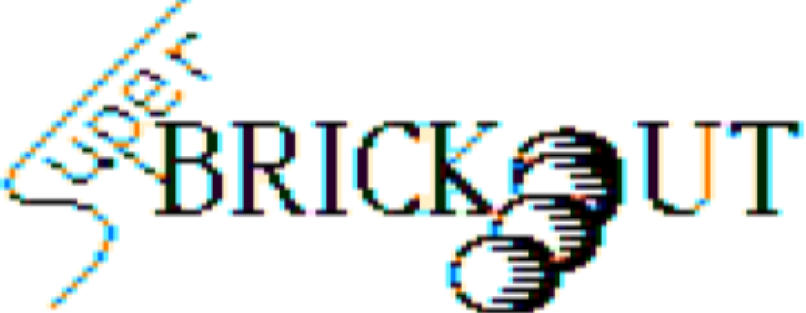

# Super BRICKOUT

Binary for the TRS-80 Color Computer (CoCo) "Super BRICKOUT" game that I wrote in 6809 assembly when I 15. 

Source code to come once I am able to get the code building using lwasm.
## Original README

My original readme documentation that I uploaded along with the `BRICKOUT.BIN` to the bulletin board. Clearly the game was inspired by BUSTOUT (a CoCo Cartridge I had) and [Arkanoid](https://en.wikipedia.org/wiki/Arkanoid) which was released in 1986 and would have been in my local Arcade.

    SUPER BRICKOUT 
    BY Owen Stenseth
    Copyright (C) 1987
    Free Ware 
    
    SUPER BRICKOUT is an enhanced version of the traditional bustout games. It has blocks that can only be destroyed from the top, side, or bottom. 
    
    It also has letters that fall and can be caught with the paddle. These are:
    
    [E] expands the paddle
    [P] gains an extra paddle
    [B] breaks from one level to the next
    [C] allows the ball to be caught on the paddle 
        and can be rleased by pressing the fire button
    [S] slows the ball
    
    SUPER BRICKOUT is freeware. Send any money to (Owen Stenseth [REDACTED])
    
    SUPER BRICKOUT is a stand alone program and needs no loader. Just load the program and EXEC to play. Any updates to this program will be sent out to the board as quickly as posible for you.
    
    Thank you kind souls.

## Dedication

This game would not exist if not for my high school best friend Angus. We spent all of our spare at each others houses writing and learning assembly, drinking instant coffee and playing P51 over a NULL modem until the wee hours of the morning. Rest in peace my friend. You profoundly shaped the course of my life in the short time you were here.